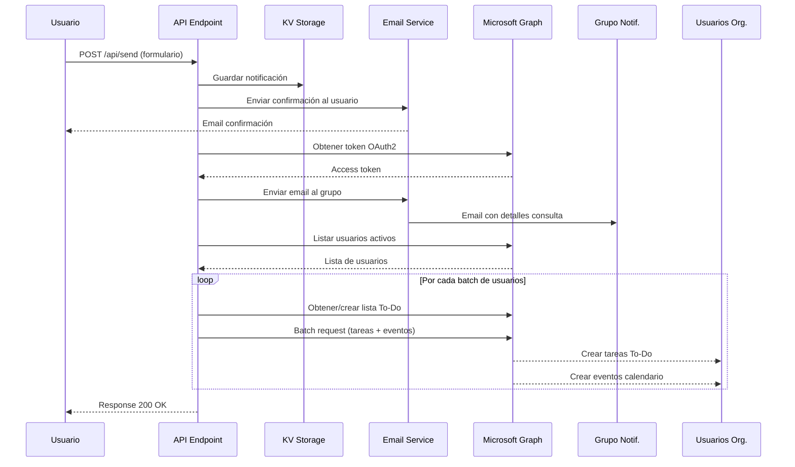

# Sistema de Notificaciones - Documentación Técnica

## Descripción General

El sistema de notificaciones procesa las consultas recibidas a través del formulario de contacto y las distribuye automáticamente a todos los usuarios de la organización mediante Microsoft Graph API.

## Flujo de Trabajo



## Componentes del Sistema

### 1. API Endpoint (`/api/send/route.ts`)

**Responsabilidad**: Orquestar el flujo completo de notificaciones

**Flujo**:
1. Validar datos del formulario
2. Guardar en KV Storage
3. Enviar email de confirmación al usuario
4. Llamar a `processNotification()` para notificar a la organización
5. Retornar respuesta

### 2. Email Service (`/lib/email.ts`)

**Funciones principales**:

#### `sendEmail()`
Envía un email usando Microsoft Graph API.

```typescript
await sendEmail({
  to: "destinatario@example.com",
  subject: "Asunto del correo",
  html: "<p>Contenido HTML</p>",
  azureConfig: {
    tenantId: "...",
    clientId: "...",
    clientSecret: "...",
    emailSender: "noreply@tudominio.es"
  }
});
```

#### `listActiveUsers()`
Lista todos los usuarios activos de la organización, excluyendo la cuenta noreply.

```typescript
const users = await listActiveUsers(accessToken, "noreply@tudominio.es");
// Retorna: GraphUser[]
```

#### `getOrCreateTodoList()`
Obtiene o crea una lista To-Do específica para un usuario.

```typescript
const listId = await getOrCreateTodoList(
  accessToken,
  userId,
  "Notificaciones Automáticas"
);
```

#### `executeBatch()`
Ejecuta múltiples operaciones en un solo request a Microsoft Graph.

```typescript
const batchRequests = [
  {
    id: "task-1",
    method: "POST",
    url: "/users/{id}/todo/lists/{listId}/tasks",
    headers: { "Content-Type": "application/json" },
    body: { title: "Nueva tarea" }
  },
  // ... hasta 20 requests
];

const result = await executeBatch(accessToken, batchRequests);
```

#### `processNotification()`
Función principal que coordina todo el proceso de notificación.

```typescript
await processNotification(
  {
    name: "Juan",
    surname: "Pérez",
    email: "juan@example.com",
    subject: "Consulta legal",
    body: "Necesito ayuda con...",
    timestamp: Date.now()
  },
  {
    tenantId: "...",
    clientId: "...",
    clientSecret: "...",
    emailSender: "noreply@tudominio.es",
    notificationGroup: "notificaciones@tudominio.es"
  }
);
```

### 3. KV Storage (`/lib/kv-storage.ts`)

Almacena las notificaciones en Cloudflare KV con compresión gzip.

**Funciones**:
- `addNotification()` - Agrega una nueva notificación
- `readNotifications()` - Lee todas las notificaciones
- `clearNotifications()` - Limpia el storage

## Optimizaciones Implementadas

### 1. Email al Grupo (Eficiencia)

**Antes**: Un email por usuario → N llamadas a Graph API
**Ahora**: Un email al grupo → 1 llamada a Graph API

**Ventajas**:
- Reduce llamadas API en un 95%
- Menor probabilidad de throttling
- Gestión centralizada de destinatarios
- Menor latencia en el endpoint

### 2. Batch Processing

**Estrategia**: Agrupar operaciones en batches de máximo 20 sub-requests

**Implementación**:
- Cada usuario requiere 2 operaciones: tarea To-Do + evento calendario
- Batch size: 6 usuarios = 12 sub-requests
- Margen de seguridad para no exceder el límite de 20

```typescript
const BATCH_SIZE = 6; // 6 usuarios × 2 operaciones = 12 requests
```

### 3. Procesamiento Secuencial de Batches

**Decisión**: Ejecutar batches secuencialmente en lugar de paralelamente

**Razón**: Evitar throttling de Microsoft Graph API

```typescript
for (let batchIndex = 0; batchIndex < batches.length; batchIndex++) {
  // Procesar batch
  await executeBatch(accessToken, batchRequests);
}
```

**Alternativa futura**: Implementar concurrencia limitada (3-5 batches paralelos) con retry logic

## Estructura de Datos

### NotificationData

```typescript
interface NotificationData {
  name: string;              // Nombre del contacto
  surname: string;           // Apellido del contacto
  email: string;             // Email del contacto
  subject: string;           // Asunto de la consulta
  body: string;              // Cuerpo del mensaje
  category?: string;         // Categoría opcional
  tags?: string[];           // Tags opcionales
  timestamp: number;         // Timestamp en ms
}
```

### GraphUser

```typescript
interface GraphUser {
  id: string;                     // ID del usuario en Azure AD
  displayName: string;            // Nombre completo
  userPrincipalName: string;      // UPN (email)
  mail: string;                   // Email
  accountEnabled: boolean;        // Si la cuenta está activa
}
```

### TodoTask

```typescript
interface TodoTask {
  title: string;                 // Título de la tarea
  body?: {
    contentType: string;         // "text" o "html"
    content: string;             // Contenido
  };
  dueDateTime?: {
    dateTime: string;            // ISO 8601 format
    timeZone: string;            // "Europe/Madrid"
  };
}
```

### CalendarEvent

```typescript
interface CalendarEvent {
  subject: string;                    // Asunto del evento
  body: {
    contentType: string;              // "HTML" o "Text"
    content: string;                  // Contenido HTML/texto
  };
  start: {
    dateTime: string;                 // ISO 8601 format
    timeZone: string;                 // "Europe/Madrid"
  };
  end: {
    dateTime: string;                 // ISO 8601 format
    timeZone: string;                 // "Europe/Madrid"
  };
  isReminderOn?: boolean;             // Activar recordatorio
  allowNewTimeProposals?: boolean;    // Permitir propuestas
}
```

## Manejo de Errores

### Estrategia de Resiliencia

1. **Try-Catch por Usuario**: Si falla la preparación de requests para un usuario, se captura el error y se continúa con el siguiente

2. **Try-Catch por Batch**: Si falla un batch completo, se captura el error y se continúa con el siguiente batch

3. **Logging Detallado**: Todos los errores se registran con contexto

```typescript
try {
  const listId = await getOrCreateTodoList(accessToken, user.id);
  // ... preparar requests
} catch (error) {
  console.error(`[Notification] Error preparing requests for user ${user.id}:`, error);
  // Continuar con el siguiente usuario
}
```

### Validación de Respuestas Batch

```typescript
const batchResult = await executeBatch(accessToken, batchRequests);
const successCount = batchResult.responses.filter((r) => r.status < 400).length;
console.log(`Batch completed: ${successCount}/${batchRequests.length} successful`);
```

## Consideraciones de Rendimiento

### Tiempos Estimados

Para una organización con **N usuarios**:

| Operación | Tiempo Estimado |
|-----------|----------------|
| Email confirmación usuario | ~500ms |
| Email al grupo | ~500ms |
| Listar usuarios | ~300ms |
| Obtener/crear lista To-Do (por usuario) | ~400ms |
| Ejecutar batch (6 usuarios) | ~1s |

**Tiempo total estimado**: 2s + (N / 6) segundos

Ejemplos:
- 10 usuarios: ~4 segundos
- 30 usuarios: ~7 segundos
- 60 usuarios: ~12 segundos

### Límites de Microsoft Graph

| Recurso | Límite |
|---------|--------|
| Requests por batch | 20 |
| Batches concurrentes | No recomendado más de 5 |
| Throttling general | Varía por tenant |
| Token expiration | 3600s (1 hora) |

## Testing

### Escenarios de Prueba

1. **Happy Path**
   - Usuario envía formulario válido
   - Sistema procesa correctamente
   - Todos reciben notificaciones

2. **Usuario sin Licencia To-Do**
   - Sistema intenta crear lista To-Do
   - Falla pero continúa con evento calendario

3. **Usuario sin Buzón**
   - Sistema falla al crear evento
   - Continúa con siguiente usuario

4. **Throttling de Graph API**
   - Detectar respuesta 429
   - Implementar retry con backoff (futura mejora)

5. **Token Expirado**
   - Obtener nuevo token
   - Reintentar operación

### Comandos de Prueba

```bash
# Enviar request de prueba
curl -X POST http://localhost:3000/api/send \
  -H "Content-Type: application/json" \
  -d '{
    "name": "Test",
    "surname": "User",
    "email": "test@example.com",
    "subject": "Prueba del sistema",
    "body": "Este es un mensaje de prueba"
  }'
```

## Mejoras Futuras

### 1. Retry Logic con Exponential Backoff

```typescript
async function executeWithRetry(fn: () => Promise<any>, maxRetries = 3) {
  for (let i = 0; i < maxRetries; i++) {
    try {
      return await fn();
    } catch (error) {
      if (i === maxRetries - 1) throw error;
      const delay = Math.pow(2, i) * 1000; // 1s, 2s, 4s
      await new Promise(resolve => setTimeout(resolve, delay));
    }
  }
}
```

### 2. Procesamiento Asíncrono con Queue

Usar Cloudflare Queues para procesar notificaciones en background:

```typescript
// En el endpoint
await queue.send({ notificationData, azureConfig });
return NextResponse.json({ status: "queued" });

// En el consumer
export default {
  async queue(batch, env) {
    for (const message of batch.messages) {
      await processNotification(message.body.notificationData, message.body.azureConfig);
    }
  }
}
```

### 3. Caché de Listas To-Do

Cachear los IDs de las listas To-Do para evitar búsquedas repetidas:

```typescript
const todoListCache = new Map<string, string>();

async function getCachedTodoList(userId: string): Promise<string> {
  if (todoListCache.has(userId)) {
    return todoListCache.get(userId)!;
  }
  const listId = await getOrCreateTodoList(accessToken, userId);
  todoListCache.set(userId, listId);
  return listId;
}
```

### 4. Webhooks para Confirmación

Implementar webhooks de Microsoft Graph para recibir confirmaciones de entrega.

### 5. Dashboard de Monitoreo

Crear un dashboard para visualizar:
- Notificaciones enviadas
- Tasa de éxito/fallo
- Tiempos de procesamiento
- Usuarios afectados

## Referencias

- [Microsoft Graph API Documentation](https://learn.microsoft.com/en-us/graph/)
- [Microsoft Graph Batching](https://learn.microsoft.com/en-us/graph/json-batching)
- [Microsoft Graph Throttling](https://learn.microsoft.com/en-us/graph/throttling)
- [Cloudflare Workers KV](https://developers.cloudflare.com/kv/)
